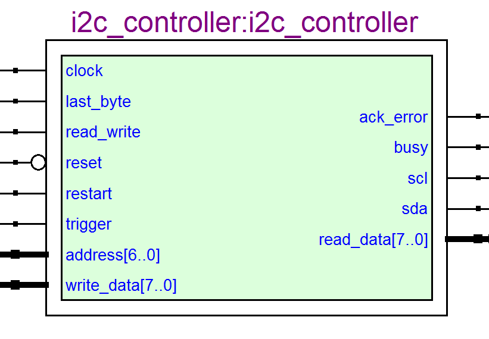
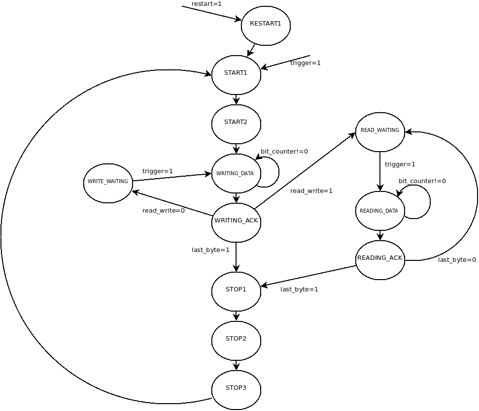
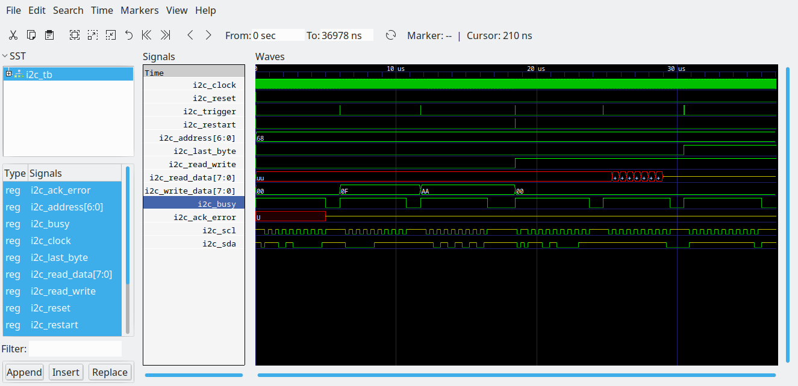

# An I2C Controller in VHDL

This is an I2C controller I've written principally for integration into various 68000 based computers that I've built, but since it could be used in any PL project requiring an I2C controller I thought I'd share it.

# Summary

(I'm unsure why Quartus has added an inverting symbol to the reset signal, it is active high, like all signals in the design.)

The controller contains a clock divider, which is currently fixed to 6 bits of counter. This is used to generate the SCL signal and drive the state machine. At some point the size of this counter will become a generic. 

GHDL is used to build the design and run a simulation, with a simple Makefile.

# Usage

The controller is exercised as follows. All signals are active high.

## Write operation

1. Pulse reset, if this is the first transaction
1. Set last_byte, restart and trigger to 0 and read_write to 1, and the 7 bit slave address
1. Pulse trigger
1. Wait for busy to return to 0
1. Check ack_error and react accordingly
1. For each byte to send which is not the last byte:
	1. Set the byte to send in write_data
	1. Pulse trigger
	1. Wait for busy to return to 0
	1. Check the ack_error signal and react accordingly
1. For the final byte:
	1. Set the last_byte to 1
	1. Repeat the above steps

## Read operation

1. Pulse reset, if this is the first transaction
1. Set last_byte, restart and trigger to 0 along with read_write to 0, and the 7 bit slave address
1. Pulse trigger
1. Wait for busy to return to 0
1. Check ack_error and react accordingly
1. For each byte to recieve which is not the last byte:
	1. Pulse trigger
	1. Wait for busy to return to 0
	1. Latch read_data
1. For the final byte:
	1. Set the last_byte to 1
	1. Repeat the above steps

## Restarts

Setting restart to 1 with a trigger pulse will send the start sequence followed by the address and read_write mode. This can be used to switch from write to read without going through the stop sequence, and is useful for interfacing with EEPROMs and similar devices.

# Internals

The following is a state-transition diagram for the main part of the entity:

A rough description of the states used is as follows:

* START1 and START2: The start waveform is generated, ie the SDA pin lowers while the SCL remains high.
* WRITING_DATA : The 8 bits of data are clocked out. The same state is used for sending the slave address as sending useful data. 16 input clocks are required, since the SCL output must cycle for each bit written.
* WRITING_ACK : The ACK or NAK from the slave is latched by the controller. Also the controller switches to either writing or reading waiting state based on the mode requested. If this is the last byte that has to be written (last_byte = 1), the controller enters the first STOP state.
* WRITE_WAITING : Here the state machine simply hangs around waiting for the next trigger event, upon which it will latch the write_data input for the next byte.
* READING_DATA : 8 bits of data are clocked in. 16 “state clocks” are required.
* READING_ACK : The controller generates an ACK (ie. it brings SDA low) if this is not the last byte that needs reading, otherwise it makes it high for a NAK. If this is the last byte to read then the controller then enters the first STOP state, otherwise it moves onto READ_WAITING.
* READ_WAITING : The controller waits for another trigger before entering READING_DATA.
* STOP1 through STOP3 : The stop sequence generator. SDA pin is raised while SCL remains high.
* RESTART1 : This is used to lower the SDA and SCL pins in preparation for sending a fresh START sequence, and is used by some slave ICs to remove the requirement of creating a new transaction by going through a stop/start sequence.

# Testbench

The test bench is simplistic and is used to generate a waveform for a simple transaction: writing two bytes, a restart and then a read of two bytes:

Note that the testbench does not mock the slave device, which is why read_data does not contain data after the read operations.
